```{r setup, include=FALSE, warning=FALSE}
if (!requireNamespace("knitr", quietly = TRUE)) install.packages("knitr", dependencies = TRUE)

knitr::opts_chunk$set(
  echo = TRUE,
  warning = FALSE,
  message = FALSE,
  fig.dpi = 300,
  fig.align = "center"
)

options(timeout = 36000)
options(stringsAsFactors = FALSE)
options(download.file.method = "curl")
options(download.file.extra = "-k -L")

options(BioC_mirror = "https://mirrors.tuna.tsinghua.edu.cn/bioconductor")
options(repos = c(CRAN = "https://mirrors.tuna.tsinghua.edu.cn/CRAN/"))
```

# Load packages {-}
```{r}
library(tidyverse)
library(data.table)
library(openxlsx)
library(curl)

library(GEOquery)
library(limma)
library(sva)

library(AnnoProbe)
library(genefilter)
library(org.Hs.eg.db)
library(TxDb.Hsapiens.UCSC.hg19.knownGene)

library(WGCNA)
library(flashClust)
library(robustbase) 
library(dynamicTreeCut)

library(GenomicRanges)
library(RColorBrewer)
library(ggsci)
library(ggpubr)
library(ggvenn)
library(corrplot)
library(ComplexHeatmap)
library(circlize)
library(cowplot)
library(magick)
```

# Acquisition of GEO dataset

## GSE57338

313 individuals with/without Heart Failure

https://www.ncbi.nlm.nih.gov/geo/query/acc.cgi?acc=GSE57338

```{r}
raw_dir <- "../data/raw/geo/GSE57338"
if (!dir.exists(raw_dir)) dir.create(raw_dir, recursive = TRUE)

Sys.setlocale("LC_ALL", "C")
gse57338 <- getGEO("GSE57338", destdir = raw_dir, getGPL = TRUE, AnnotGPL = F)
Sys.setlocale("LC_ALL", "")

gse57338_pheno_raw <- pData(gse57338[[1]])
gse57338_exprs_raw <- exprs(gse57338[[1]])
gse57338_gpl <- gse57338[[1]]@annotation

save(
  gse57338_pheno_raw,
  gse57338_exprs_raw,
  gse57338_gpl,
  file = "../data/raw/geo/gse57338_raw.RData"
)
```

## GSE116250

high throughput sequencing, GPL16791

64 samples from human left ventricle tissue: 14 non-failing donors, 37 dilated cardiomyopathy, and 13 ischemic cardiomyopathy

N_DCM/N_NF = 37 / 14
```{r}

```

## GSE5406

array, GPL96

https://www.ncbi.nlm.nih.gov/geo/query/acc.cgi?acc=GSE5406

n_DCM = 86, n_IDC = 108, n_HF = 16

```{r}
rm(list=ls())

raw_dir <- "../data/raw/geo/GSE5406"
if (!dir.exists(raw_dir)) dir.create(raw_dir, recursive = TRUE)

Sys.setlocale("LC_ALL", "C")
gse5406 <- getGEO("GSE5406", destdir = raw_dir, getGPL = TRUE, AnnotGPL = F)
Sys.setlocale("LC_ALL", "")

gse5406_pheno_raw <- pData(gse5406[[1]])
gse5406_exprs_raw <- exprs(gse5406[[1]])
gse5406_gpl <- gse5406[[1]]@annotation

save(
  gse5406_pheno_raw,
  gse5406_exprs_raw,
  gse5406_gpl,
  file = "../data/raw/geo/gse5406_raw.RData"
)

```

## GSE183852

scRNA-Seq

https://www.ncbi.nlm.nih.gov/geo/query/acc.cgi?acc=GSE183852

**NOTE**: **Proceed with caution!** GSE183852_DCM_Integrated.Robj.gz is 11.7GB. Long download time.

Alternative: download directly via browser from https://www.ncbi.nlm.nih.gov/geo/query/acc.cgi?acc=GSE183852

```{r}
rm(list=ls())

raw_dir <- "../data/raw/geo/GSE183852"
if (!dir.exists(raw_dir)) dir.create(raw_dir, recursive = TRUE)

Sys.setlocale("LC_ALL", "C")
gse183852  <- getGEO("GSE183852",  destdir = raw_dir, getGPL = TRUE, AnnotGPL = F)
Sys.setlocale("LC_ALL", "")

gse183852_pheno_raw <- pData(gse183852[[1]])
gse183852_gpl <- gse183852[[1]]@annotation

save(
  gse183852_gpl,
  gse183852_pheno_raw,
  file = "../data/raw/geo/gse183852_raw.RData"
)

url <- "https://www.ncbi.nlm.nih.gov/geo/download/?acc=GSE183852&format=file&file=GSE183852%5FIntegrated%5FCounts%2Ecsv%2Egz"
h <- new_handle()
curl_fetch_disk(url, path = "../data/raw/geo/GSE183852/GSE183852_Integrated_Counts.csv.gz",handle = h)


# 11.7 GB
url <- "https://www.ncbi.nlm.nih.gov/geo/download/?acc=GSE183852&format=file&file=GSE183852%5FDCM%5FIntegrated%2ERobj%2Egz" 

h <- new_handle()
curl_fetch_disk(url, path = "../data/raw/geo/GSE183852/GSE183852_DCM_Integrated.Robj.gz",handle = h)

rm(list=ls())
gc()
```

# Preprocessing of GSE57338
## Load data
```{r}
rm(list = ls())
load("../data/raw/geo/GSE57338_raw.RData")

HC <- gse57338_pheno_raw$`disease status:ch1` == "non-failing"
HF <- gse57338_pheno_raw$`disease status:ch1` == "idiopathic dilated CMP"

keep_samples <- rownames(gse57338_pheno_raw)[HC | HF]
pheno <- gse57338_pheno_raw[keep_samples, ]

pheno$group <- ifelse(pheno$`disease status:ch1` == "non-failing", "HC", "HF") 
pheno$group <- factor(pheno$group, levels = c("HC", "HF"))

expr_keep <- gse57338_exprs_raw[,keep_samples]
```

## Preprocessing
```{r}
# log2 transformation
ex <- expr_keep
qx <- as.numeric(quantile(ex, c(0., 0.25, 0.5, 0.75, 0.99, 1.0), na.rm=T))
LogC <- (qx[5] > 100) ||
          (qx[6]-qx[1] > 50 && qx[2] > 0)
if (LogC) { ex[which(ex <= 0)] <- NaN
  expr_keep <- log2(ex) }

# check GPL and annotate the probes to genes.

probe2gene=idmap(gse57338_gpl) 
expr_annotated <- filterEM(expr_keep, probe2gene)

# Processing of duplicated genes
expr <- as.matrix(expr_annotated)
if (any(duplicated(rownames(expr)))) {
  expr <- aggregate(expr, by = list(rownames(expr)), FUN = mean)
  rownames(expr) <- expr[,1]
  expr <- expr[,-1]
  expr <- as.matrix(expr)
}
```

### Figure S1A 
```{r}
# Express the overall distribution of values and observe where the "tail" of background noise falls
expr_density <- reshape2::melt(expr) %>%
  dplyr::rename(Gene = Var1, Sample = Var2)

lancet_colors <- pal_lancet()(9)   
col1 <- lancet_colors[2]           
col2 <- lancet_colors[1]           

n_samples <- length(unique(expr_density$Sample))
sample_colors <- colorRampPalette(c(col1, col2))(n_samples)


pS1A <- ggplot(expr_density, aes(x = value, color = Sample)) +   
  geom_density(show.legend = FALSE,linewidth = 0.2) + 
  scale_color_manual(values = sample_colors) + 
  labs(title = "Expression density of samples",
       x = "log2(Expression)", y = "Density") + 
  theme_bw(base_size = 10) +
  scale_x_continuous(breaks = seq(from = floor(min(expr_density$value)), to = ceiling(max(expr_density$value)), by = 1)) +
  geom_vline(xintercept = 3, linetype = "dashed", color = lancet_colors[2], linewidth = 0.5) + 
  theme(plot.title = element_text(hjust = 0.5,size = 10),
        axis.title = element_text(size = 9),
        axis.text = element_text(size = 8,color = "grey5"),
        axis.ticks.length = unit(0.5, "mm"),
  axis.ticks = element_line(linewidth = 0.5))

# pS1A

ggsave("../supplementary/figures/Figure_S1_A.png", pS1A, width = 7, height = 5,units = "cm", dpi = 600)
```

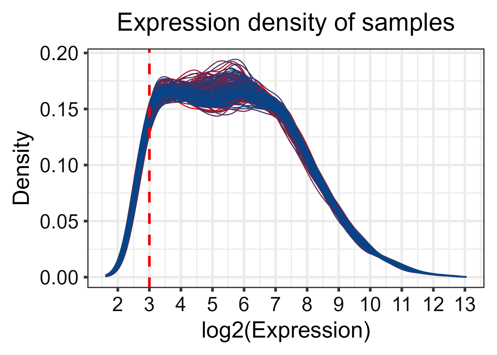

### Figure S1C: Check normalization
```{r}
# Filtering low expression genes
threshold_log2 <- 3
ffun <- filterfun(pOverA(p = 0.5, A = threshold_log2))
keep <- genefilter(expr, ffun)

expr_filt <- expr[keep, ]
dim(expr_filt)

expr_melt <- reshape2::melt(expr_filt, varnames = c("Gene", "Sample"), value.name = "log2_expr")


pS1C <- ggplot(expr_melt, aes(x = Sample, y = log2_expr)) +
  geom_boxplot(fill="lightblue", outlier.shape = 1, outlier.size = 0.3,outlier.stroke = 0.1, linewidth =0.3) +
  # scale_fill_lancet() + 
  labs(title = "Check normalization of samples", y = "log2( Expression)") +
  theme_bw(base_size = 10) +
  theme(axis.text.x = element_blank(), 
        axis.ticks.x = element_blank(),
        axis.title = element_text(size = 9),
        axis.text.y = element_text(size = 8,color = "grey5"),
        axis.ticks.y.length = unit(0.5, "mm"),
        axis.ticks = element_line(linewidth = 0.5),
        plot.title = element_text(hjust = 0.5, size = 10)) +
  geom_hline(yintercept = median(expr_melt$log2_expr, na.rm = TRUE), linetype = "dashed", linewidth =0.5, color =lancet_colors[2])

# pS1C

ggsave("../supplementary/figures/Figure_S1C.png", pS1C, width = 14, height = 5,units = "cm", dpi = 600)
```

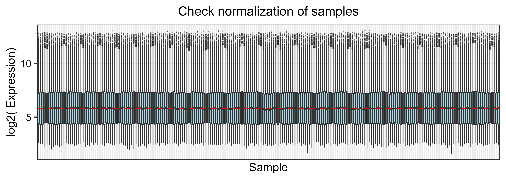

### Figure S1B: PCA 
```{r}
pca <- prcomp(t(expr_filt), scale. = TRUE)

pca_df <- data.frame(pca$x[,1:2], Group = pheno$group)

pS1B <- ggplot(pca_df, aes(x = PC1, y = PC2, color = Group)) + 
  scale_color_lancet() + 
  geom_point(size = 1) + 
  stat_ellipse() + 
  labs(title = "PCA of samples") +
  theme_bw(base_size = 10) +
  theme(
    plot.title = element_text(hjust = 0.5, size = 10),
    axis.title = element_text(size = 9),
    axis.text = element_text(size = 8),
    axis.ticks.length = unit(0.5, "mm"),
    axis.ticks = element_line(linewidth = 0.5),
    legend.position = "right",
    legend.title = element_text(size = 9),
    legend.text = element_text(size = 8,color = "grey5"), 
    legend.spacing.x = unit(0, "cm"),
    legend.key.width = unit(0.5, "cm"),
    legend.box.margin = margin(t = 0, r = 0, b = 0, l = -2.5, unit = "mm"),
    legend.margin = margin(t = 0, r = 0, b = 0, l = 0, unit = "mm")
    
  )

# pS1B

ggsave("../supplementary/figures/Figure_S1B.png",pS1B, width = 7,height = 5,units = "cm", dpi = 600)
```

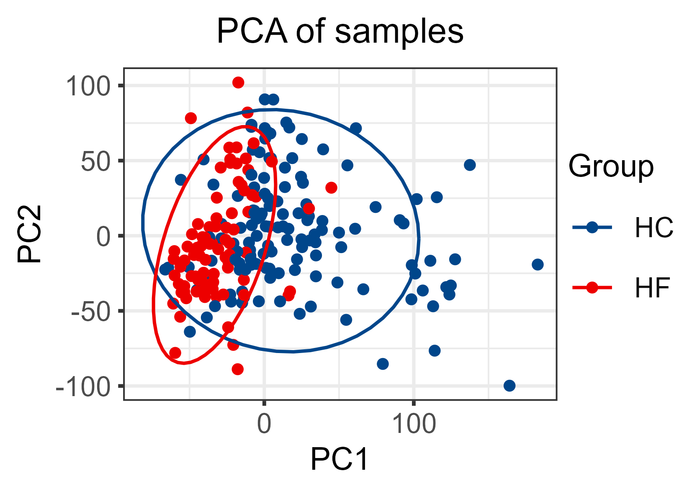

### Correlation within the group
```{r}
cor_mat <- cor(expr_filt)

within_cor <- sapply(colnames(expr_filt), function(s) {
  idx <- which(pheno$geo_accession == s)
  gr <- pheno$group[idx]
  same_group <- pheno$geo_accession[pheno$group == gr]
  same_group <- setdiff(same_group, s)
  
  if (length(same_group) == 0) return(NA)
  mean(cor_mat[s, same_group], na.rm = TRUE)
})

between_cor <- sapply(colnames(expr_filt), function(s) {
  idx <- which(pheno$geo_accession == s)
  gr <- pheno$group[idx]
  diff_group <- pheno$geo_accession[pheno$group != gr]
  if(length(diff_group)==0) return(NA)
  mean(cor_mat[s, diff_group], na.rm = TRUE)
})

mean_within = mean(within_cor, na.rm = TRUE)
mean_between = mean(between_cor, na.rm = TRUE)

cat("Average correlation coefficient within the group：", round(mean_within, 4), "\n")
cat("Average correlation coefficient between groups：", round(mean_between, 4), "\n")

if (mean_within > mean_between) {
  cat("✅ No significant batch effect\n")
} else {
  cat("⚠️ Have significant batch effect, suggest batch correction(ComBat/SVA)\n")
}

save(pheno, expr_filt, file = "../data/processed/geo/gse57338.RData")
```

### Figure S1: cowplot
```{r}
top <- plot_grid(pS1A, pS1B, ncol = 2, labels = c("A", "B"), 
                 label_size = 12, label_fontface = "bold", 
                 align = "h", axis = "tb")  

bottom <- plot_grid(pS1C, labels = "C", label_size = 12, label_fontface = "bold")


sf1_combined <- plot_grid(top, bottom, ncol = 1, rel_heights = c(1, 1)) 

ggsave("../supplementary/figures/Figure_S1.png", 
       sf1_combined, width = 14, height = 10, units = "cm", dpi = 600)
```


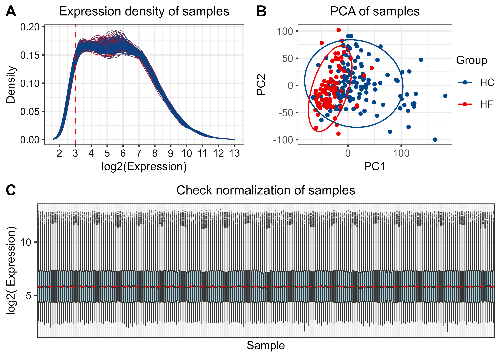


# DEG
## DEGs
```{r}
load("../data/processed/geo/gse57338.RData")
group <- factor(pheno$group)  
design <- model.matrix(~ 0 + group)
colnames(design) <- levels(group)
contr <- paste(levels(group)[2], levels(group)[1], sep = "-")
contr.matrix <- makeContrasts(contrasts = contr, levels = design)

fit <- lmFit(expr_filt, design)
fit2 <- contrasts.fit(fit, contr.matrix)
fit2 <- eBayes(fit2)

res <- topTable(fit2, adjust = "fdr", number = Inf)

save(res, file = "../data/processed/geo/gse57338_res.RData")
```

## Significant DEGs
```{r}
# lfc <- log2(1.5)
lfc <- 0.585

deg_all <- as.data.frame(res) %>%
  dplyr::rename(log2FC = logFC)

deg_up <- deg_all %>% filter(adj.P.Val < 0.05, log2FC > lfc)
deg_down <- deg_all %>% filter(adj.P.Val < 0.05, log2FC < -lfc)

cat("The number of all DEGs:", nrow(deg_all), "\n")
cat("The number of up DEGs:", nrow(deg_up), "\n")
cat("The number of down DEGs:", nrow(deg_down), "\n")
```

## Figure 1A: Volcano Plot
```{r}
deg_all$significance <- ifelse(
  deg_all$`adj.P.Val` < 0.05 & abs(deg_all$log2FC) > lfc,
  ifelse(deg_all$log2FC > lfc, paste0("Up(",nrow(deg_up),")"), paste0("Down(",nrow(deg_down),")")), "NS")

p1A <- ggplot(deg_all, aes(x = log2FC, y = -log10(adj.P.Val), color = significance)) +
  geom_point(alpha = 0.7, size = 0.5) +
  scale_color_manual(values = c(pal_lancet()(9)[1], "gray", pal_lancet()(9)[2])) +
  geom_vline(xintercept = c(-lfc, lfc), linetype = "dashed", color = "gray40", linewidth = 0.4) +
  geom_hline(yintercept = -log10(0.05), linetype = "dashed", color = "gray40", linewidth = 0.4) +
  labs(
    # tag = "A",
    x = "log2(Fold Change)", 
    y = "-log10(Adjusted P)") +
  theme_bw(base_size = 10) +
  theme(
    plot.title = element_text(hjust = 0.5, size = 10),
    axis.title = element_text(size = 9),
    axis.text = element_text(size = 8, color = "grey5"),
    legend.position = "right",
    legend.title = element_text(size = 9),
    legend.text = element_text(size = 8, margin = margin(l = -0.2, unit = "cm")),
    legend.box.spacing = unit(0.1, "cm"),
    legend.box.margin = margin(0, 0, 0, 0),
    legend.margin = margin(0, 0, 0, 0),
    # plot.tag = element_text(size = 12, face = "bold"),
    # plot.tag.position = c(0.02, 0.97),
    plot.margin = margin(t = 1, r = 2, b = 2, l = 2)
  ) 

ggsave("../main/figures/Figure_1A.png", p1A, width = 7,height = 5, units = "cm", dpi = 600)

ggsave("../main/figures/Figure_1A.pdf", p1A, width = 7,height = 5, units = "cm")
```

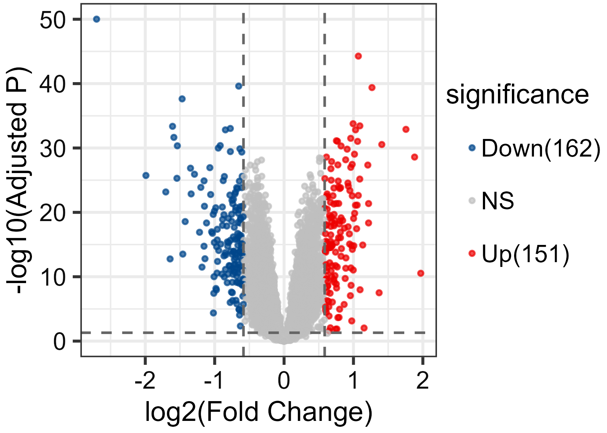

## Figure 1B. Heatmap 
```{r}
deg_sig <- deg_all %>% filter(adj.P.Val < 0.05, abs(log2FC) > lfc)

N_top <- 50

up_top <- deg_sig %>%
  filter(log2FC > 0) %>%
  arrange(desc(log2FC)) %>%
  head(N_top)

down_top <- deg_sig %>%
  filter(log2FC < 0) %>%
  arrange(log2FC) %>%
  head(N_top)

heat_genes <- c(rownames(up_top), rownames(down_top))

sample_order <- pheno %>%
  arrange(group) %>%   
  pull(geo_accession)  

deg_top100 <- expr_filt[heat_genes, sample_order]

deg_top100_z <- t(scale(t(deg_top100)))

breaks <- seq(-2, 2, length.out = 100)
palette <- colorRampPalette(c(pal_lancet()(9)[1], "white", pal_lancet()(9)[2]))(99)
if (length(breaks) == length(palette)) {
  col_fun <- colorRamp2(breaks, palette)
} else {
  mid_breaks <- (breaks[-1] + breaks[-length(breaks)]) / 2
  col_fun <- colorRamp2(mid_breaks, palette)
}

sample_order <- pheno %>%
  arrange(group) %>%   
  pull(geo_accession)  

# Group annotation
anno_col <- data.frame(
  Group = pheno$group[match(sample_order, pheno$geo_accession)]
)
rownames(anno_col) <- sample_order
anno_col$Group <- factor(anno_col$Group, levels = c("HF", "HC"))

ha <- HeatmapAnnotation(
  group_label = anno_block(
    which = "column",
    gp = gpar(fill = NA, col = NA),          
    panel_fun = function(index, nm) {
      n <- length(index)
      group_vec <- anno_col$Group[index]
      col_map <- c("HF" = lancet_colors[2], "HC" = lancet_colors[1])
      colors <- col_map[group_vec]

      for (i in seq_along(index)) {
        x_left <- (i - 1) / n
        grid.rect(
          x = x_left, y = 0,
          width = 1 / n, height = 1,
          just = c("left", "bottom"),
          gp = gpar(fill = colors[i], col = NA)  
        )
      }
      
      rle_res <- rle(as.character(group_vec))   
      cum_pos <- cumsum(c(0, rle_res$lengths[-length(rle_res$lengths)])) / n
      for (i in seq_along(rle_res$values)) {
        center_x <- cum_pos[i] + (rle_res$lengths[i] / n) / 2
        grid.text(
          label = rle_res$values[i],
          x = center_x,
          y = 0.5,
          gp = gpar(fontsize = 8, fontface = "bold", col = "white")
        )
      }
    }
  ),
  show_legend = FALSE,
  show_annotation_name = FALSE,
  annotation_height = unit(0.3, "cm")
)

ht_opt(HEATMAP_LEGEND_PADDING = unit(0, "mm"))
p1B <- Heatmap(
  deg_top100_z,
  name = "Log2FC",
  col = col_fun,
  show_row_names = FALSE,
  show_column_names = FALSE,
  cluster_rows = TRUE,
  cluster_columns = FALSE,
  show_column_dend = FALSE,
  row_dend_width = unit(0.08, "npc"), 
  border = FALSE,
  top_annotation = ha,
  # show_heatmap_legend = FALSE, # Annotate when drawing p1B
  heatmap_legend_param = list(
    title = "",
    labels_gp = gpar(fontsize = 8, color="grey5"),
    legend_width = unit(0.3, "cm"),
    legend_height = unit(3, "cm"),
    grid_width = unit(0.2, "cm"),
    legend.space = unit(1, "mm"),
    legend.margin = unit(c(0, 0, 0, 0), "mm")
  )
)

png(filename = "../main/figures/Figure_1B.png", 
    width = 7, height = 5, 
    units = "cm", 
    pointsize = 10,
    res = 600)
p1B
dev.off()

pdf(file = "../main/figures/Figure_1B.pdf", 
    width = 7, height = 5,  
    pointsize = 10)
p1B
dev.off()
```

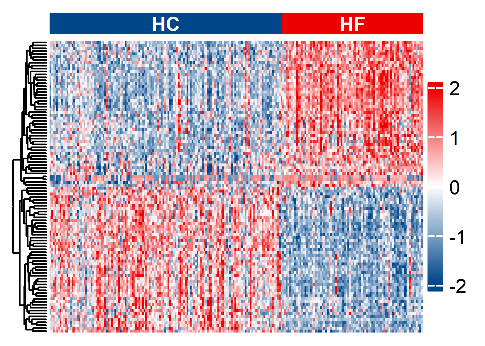

## Saving DEG Results
```{r}
save(deg_all,deg_sig,deg_up, deg_down, deg_top100, lfc, file = "../data/processed/geo/gse57338_degs_results.RData")
```

# WGCNA
## Load Data
```{r}
rm(list = ls())

load("../data/processed/geo/gse57338.RData")

# expression matrix
# WGCNA required: Sample (row) x  Gene(column)

dat <- expr_filt

common_samples <- intersect(colnames(dat), rownames(pheno))

dat <- dat[, common_samples, drop = FALSE]
pheno_wgcna <- pheno[match(common_samples, rownames(pheno)), , drop = FALSE]

if (ncol(dat) == nrow(pheno_wgcna)) {
  datExpr <- as.data.frame(t(dat))
} else if (nrow(dat) == nrow(pheno_wgcna)) {
  datExpr <- as.data.frame(dat)
} else {
  stop("Error: Sample dimension mismatch between expression matrix and phenotype data.")
} 
rownames(datExpr) <- common_samples

dim(datExpr)

# trait: group (HC=0, HF=1)
datTraits <- data.frame(
  Group = factor(pheno_wgcna$group)
)
rownames(datTraits) <- colnames(expr_filt)

datTraits$Disease <- ifelse(pheno_wgcna$group == "HF", 1, 0)
```


## Sample clustering (checking for outlier samples, quality control) 

```{r}
# goodSamplesGenes
# Quality control: Remove bad genes/samples
gsg <- goodSamplesGenes(datExpr, verbose = 3)
if (!gsg$allOK) {
  if (sum(!gsg$goodGenes) > 0) {
    printFlush(paste("Removing genes:", paste(names(datExpr)[!gsg$goodGenes], collapse = ",")))
  }
  if (sum(!gsg$goodSamples) > 0) {
    printFlush(paste("Removing samples:", paste(rownames(datExpr)[!gsg$goodSamples], collapse = ",")))
  }
  datExpr <- datExpr[gsg$goodSamples, gsg$goodGenes]
}

# Screening for highly variable genes: MAD. Retain the first 5000
gene_mad <- apply(datExpr, 2, mad, na.rm = TRUE) 
N_top <- 5000
n_select <- min(N_top, ncol(datExpr))   
selected_genes <- names(sort(gene_mad, decreasing = TRUE)[1:n_select])
datExpr <- datExpr[, selected_genes]
cat("Retain the number of highly variable genes：", ncol(datExpr), "\n")
save(datTraits,datExpr,pheno_wgcna,file = "../data/processed/geo/gse57338_datExpr.RData")
```

### Figure S2A
```{r}
# Sample clustering: sampleTree
sampleTree <- hclust(dist(datExpr), method = "average")
group_color = ifelse(pheno_wgcna$group=="HF",pal_lancet()(9)[2],pal_lancet()(9)[1])
color_mat <- cbind(Group = group_color)

png(filename = "../supplementary/figures/Figure_S2A.png", 
    width = 14, 
    height = 5, 
    units = "cm", 
    res = 600,
    pointsize = 10)

par(ps=10, 
    lwd = 0.5, 
    font.lab = 1, 
    font.main=2, 
    mai=c(0,0,0,0), 
    oma=c(0,0,0,0)
)  

plotDendroAndColors(
  dendro = sampleTree, 
  colors = color_mat, 
  dendroLabels = FALSE, 
  addGuide = TRUE,       
  # guideCol = "grey",
  main = "Sample clustering",
  cex.dendroLabels = 0.8,
  cex.colorLabels = 1,
  cex.axis = 0.9,
  cex.lab = 1,
  cex.main = 1.0,
  marAll = c(0.1, 3, 0.8, 0), 
  saveMar = TRUE,
  lwd = 0.5,
  mgp = c(2, 1, 0)
)
dev.off()
```

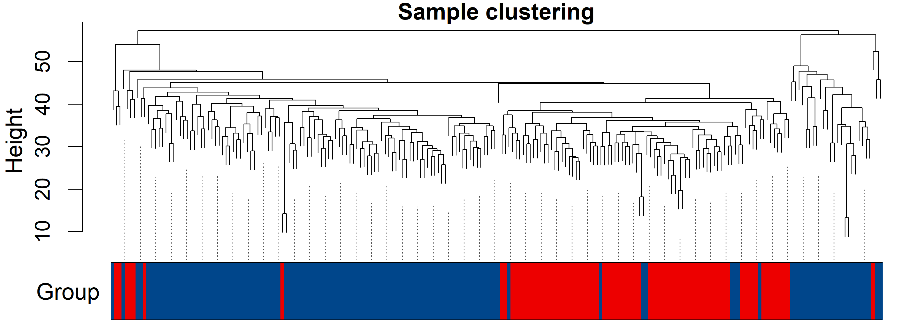

---

## Step 3: Select soft threshold

```{r}
# load("../data/processed/geo/gse57338_datExpr.RData")
enableWGCNAThreads()
powers <- c(c(1:10), seq(from = 12, to=30, by=2))

R2_cut <- 0.8

sft <- pickSoftThreshold(
  datExpr,
  powerVector = powers,
  RsquaredCut = R2_cut, 
  verbose = 5,
  networkType = "unsigned"
)
disableWGCNAThreads()

power <- sft$powerEstimate
if(is.na(power)) power <- 8  
cat("power = ", power, "\n")

save(sft,powers, R2_cut, file="../data/processed/geo/gse57338_sft.RData")

```
### Figure S2B
```{r}
load("../data/processed/geo/gse57338_sft.RData")

df <- data.frame(
  Power = sft$fitIndices[,1],
  R2 = -sign(sft$fitIndices[,3]) * sft$fitIndices[,2],
  Connectivity = sft$fitIndices[,5]
)

# Left Figure: R² vs Soft Power
pS2B1 <- ggplot(df, aes(x = Power, y = R2)) +
  geom_text(aes(label = Power), size = 2.5, color = pal_aaas()(10)[2]) +  
  geom_hline(yintercept = R2_cut, linetype = "dashed", color = pal_aaas()(10)[2], linewidth = 0.8) +
  labs(x = "Soft Power", y = expression(Scale ~ Free ~ R^2)) +
  theme_bw(base_size = 10) +
  theme(
    panel.grid = element_blank(),
    axis.title = element_text(size = 9),     
    axis.text = element_text(size = 8, color = "grey"),
    plot.margin = margin(1, 2, 1, 2, unit = "mm")
  )

# Right Figure：Mean Connectivity vs Soft Power
pS2B2 <- ggplot(df, aes(x = Power, y = Connectivity)) +
  geom_text(aes(label = Power), size = 2.5, color = pal_aaas()(10)[2]) +
  labs(x = "Soft Power", y = "Mean Connectivity") +
  theme_bw(base_size = 10) +
  theme(
    panel.grid = element_blank(),
    axis.title = element_text(size = 9),
    axis.text = element_text(size = 8, color = "grey5"),
    plot.margin = margin(1, 2, 1, 2, unit = "mm")
  )


pS2B <- plot_grid(pS2B1, pS2B2, ncol = 2, align = "h")

ggsave("../supplementary/figures/Figure_S2_B.png", 
       plot = pS2B,
       width = 14, 
       height = 5, 
       units = "cm", 
       dpi = 600)
```


## Step 4: Construct a co-expression network

---

```{r}
enableWGCNAThreads()
set.seed(123)

net <- blockwiseModules(
  datExpr,
  power = power,
  TOMType = "unsigned",
  minModuleSize = 30,      # Minimum number of genes in the module
  mergeCutHeight = 0.25,   # Merge similar modules
  numericLabels = TRUE,
  pamRespectsDendro = FALSE,
  verbose = 3
)
disableWGCNAThreads()

save(net,file = "../data/processed/geo/gse57338_net.RData")

```

## Step 5: Clustering

---
```{r}
load("../data/processed/geo/gse57338_net.RData")

# Convert to Color
moduleColors <- labels2colors(net$colors)
table(moduleColors) # Check the number of genes in each module
```

### Figure 1C: WGCNA gene clustering tree
```{r}
png(
  "../main/figures/Figure_1C.png", 
  width = 14, 
  height = 5, 
  units = "cm", 
  res = 600,
  pointsize = 10
)

par(ps = 10, font.lab = 1, font.main=2)
plotDendroAndColors(
  net$dendrograms[[1]],
  moduleColors[net$blockGenes[[1]]],
  "Module\nColors ",
  dendroLabels = FALSE,
  addGuide = TRUE,
  guideHang = 0.2,
  colorHeight = 0.1, 
  cex.axis = 0.9,
  cex.text = 0.8,
  cex.dendroLabels = 0.8,
  cex.colorLabels = 0.8, 
  cex.lab = 1,
  cex.main = 1,
  # main ="",
  marAll = c(0.1, 2.8, 1, 0), 
  saveMar = TRUE,
  mgp = c(1.5, 0.5, 0),
  lwd = 1,
  guideLwd = 1
)
dev.off()
```

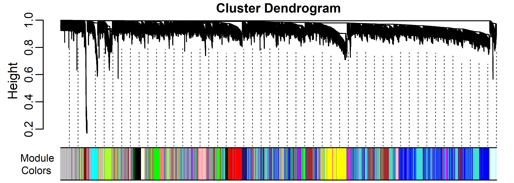

## Step 6: Module correlation with diseases

---

```{r}
load("../data/processed/geo/gse57338_datExpr.RData")

MEs <- net$MEs
MEs0 <- moduleEigengenes(datExpr, moduleColors)$eigengenes
MEs <- orderMEs(MEs0)

datTraits <- model.matrix(~0 + group, data = data.frame(group = pheno_wgcna$group))

colnames(datTraits) <- levels(factor(pheno_wgcna$group))  
rownames(datTraits) <- rownames(pheno_wgcna)

moduleTraitCor <- cor(MEs, datTraits, use = "p")
moduleTraitPvalue <- corPvalueStudent(moduleTraitCor, nrow(datExpr))


textmatrix <- paste0(signif(moduleTraitCor, 2), " (", signif(moduleTraitPvalue, 1), ")")
dim(textmatrix) <- dim(moduleTraitCor)

wgcna_colors <- blueWhiteRed(50)
```

### Figure 1D: Module phenotype correlation heatmap
```{r}
png(
  "../main/figures/Figure_1D.png", 
  width = 7, 
  height = 14, 
  units = "cm", 
  res = 600,
  pointsize = 10
)

par(ps = 10, font.lab = 1, font.main=2, 
    mar = c(1.2, 1.8, 1.2, 0.2))

labeledHeatmap(
  Matrix = moduleTraitCor,
  xLabels = colnames(datTraits),        # HC + HF
  yLabels = names(MEs),
  colors = wgcna_colors,
  textMatrix = textmatrix,
  setStdMargins = FALSE,
  cex.text = 0.8,
  cex.lab = 0.9,
  cex.main = 1,
  cex.legendLabel = 0.8,
  zlim = c(-1, 1),
  main = "Module-Trait Correlation",
  xLabelsAngle = 0,        
  xLabelsAdj = 0.5          
)
dev.off()
```

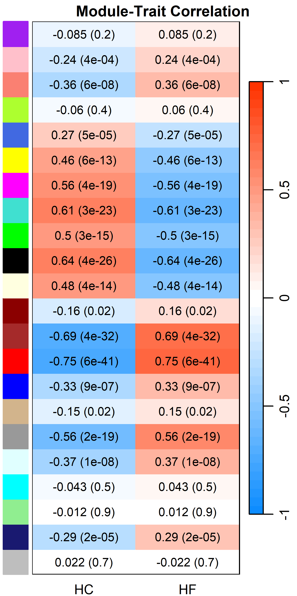

## Step 7: Extract HF‑related modules and candidate hub genes

---

```{r}
key_modules <- names(MEs)[abs(moduleTraitCor) > 0.6 & moduleTraitPvalue < 0.05]
key_modules <- gsub("ME","",key_modules)

print(key_modules)

mod_cor_HF = moduleTraitCor[,"HF"]
mod_p_HF  = moduleTraitPvalue[,"HF"]
mod_name = sub("ME","",rownames(moduleTraitCor))

mod_df = data.frame(
  Module = mod_name,
  Cor_HF = mod_cor_HF,
  Pval_HF = mod_p_HF,
  AbsCor = abs(mod_cor_HF)
) 

mod_sig <- mod_df %>%
  dplyr::filter(Pval_HF < 0.05, AbsCor >= 0.6) %>%
  arrange(desc(AbsCor))

# Calculate kME values for all genes, Module membership degree, screening the internal core of the module
kME <- signedKME(datExpr, MEs)
colnames(kME) <- paste0("kME.", gsub("kME", "", colnames(kME)))

# Calculate GS (Gene Disease Correlation)
colnames(datTraits) <- levels(factor(pheno_wgcna$group))
HF <- datTraits[, "HF"] 

GS <- apply(datExpr, 2, function(x) cor(x, HF, use = "p"))
GS_p <- apply(datExpr, 2, function(x) corPvalueStudent(cor(x, HF, use = "p"), nSamples = nrow(datExpr)))

geneInfo <- data.frame(
  Gene = colnames(datExpr),
  Module = moduleColors,
  GS_HF = GS,
  GS_pval = GS_p
)
geneInfo <- cbind(geneInfo, kME)

# Screening Hub genes (Key Modules + |kME| > 0.8 + |GS| > 0.5)

mm_cut <- 0.8
gs_cut <- 0.5

# wgcna genes
wgcna_Genes <- geneInfo %>%
  subset(Module %in% mod_sig$Module) %>%
  rowwise() %>%
  mutate(
    own_kME = get(paste0("kME.", Module)), 
    own_abs_kME = abs(own_kME)
  ) %>%
  subset(own_abs_kME > mm_cut & abs(GS_HF) > gs_cut)

cat("Number of screened wgcna genes: ", nrow(wgcna_Genes), "\n")
table(wgcna_Genes$Module)


# M~M
cor_ME <- cor(MEs)
mod_names <- gsub("ME","",colnames(MEs))
colnames(cor_ME) <- mod_names
rownames(cor_ME) <- mod_names
wgcnacol <- blueWhiteRed(100)

mat <- cor_ME
mat[lower.tri(mat, diag = TRUE)] <- NA   

df <- reshape2::melt(mat, na.rm = TRUE, varnames = c("Var1", "Var2"))
df$abs_val <- abs(df$value) 

# GS ~ MM
# module_cor <- geneInfo %>%
#   group_by(Module) %>%
#   summarise(max_abs_cor = max(abs(GS_HF), na.rm = TRUE)) %>%
#   arrange(desc(max_abs_cor)) %>%
#   # slice_head(n = 4) %>%
#   pull(Module)

# select_mod <- module_cor
select_mod <- mod_sig$Module
```

### Figure 1E: M~M Correlation plot
```{r}
p1E <- ggplot(df, aes(x = Var1, y = Var2)) +
  geom_point(aes(fill = value, size = abs_val), 
             shape = 21, stroke = 0.3) +
  scale_fill_gradientn(
    colors = wgcnacol,
    limits = c(-1, 1),
    name = "Corr"
  ) +
  
  scale_size_continuous(
    range = c(1, 2),       
    guide = "none"        
  ) +
  coord_fixed() +

  theme_bw(base_size = 10) +
  theme(
    panel.grid = element_blank(),          
    panel.border = element_blank(),      
    axis.ticks = element_blank(),    
    axis.title = element_blank(), 
    axis.text = element_text(size = 8, color = "grey5"),  
    axis.text.x = element_text(angle = 90, hjust = 0, size = 8, vjust = 0.5),
    axis.text.y = element_text(size = 8),
    legend.position = c(0.8,0.3),
    legend.key.width = unit(0.2, "cm"),   
    legend.key.height = unit(0.3, "cm"),
    legend.text = element_text(size = 8),
    legend.title = element_text(size = 8),
    plot.margin = margin(0.1, 1, 0.1, 1)      
  ) +
  
  scale_x_discrete(position = "top") + 
  scale_y_discrete(position = "left")

ggsave("../main/figures/Figure_1E.png", p1E, width = 7, height = 7, units = "cm", dpi = 600)
```

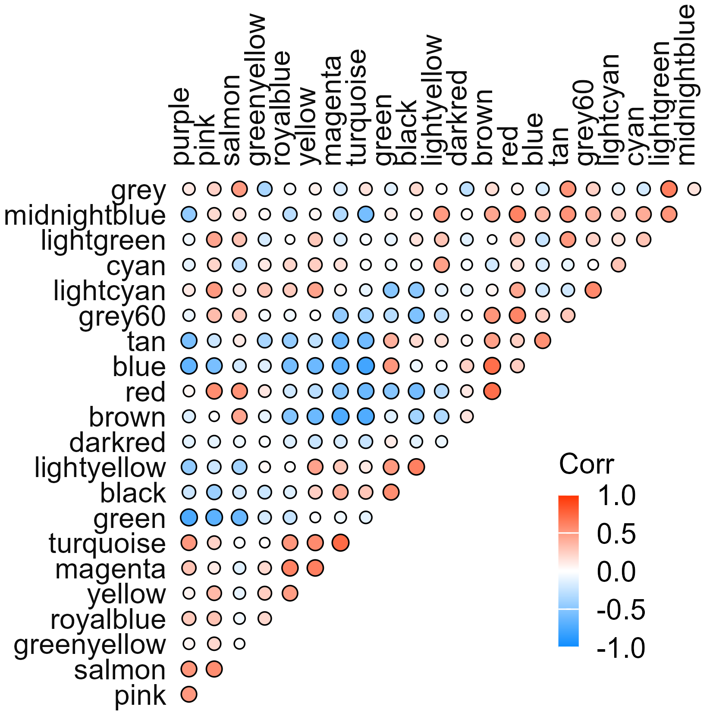

### Figure 1F: GS vs MM scatter plot
```{r}
plot_data <- geneInfo %>%
  filter(Module %in% select_mod) %>%
  mutate(Module = factor(Module, levels = select_mod)) %>%
  rowwise() %>%
  mutate(
    MM = abs(get(paste0("kME.", Module))),
    GS_abs = abs(GS_HF),
    group = ifelse(MM > mm_cut & GS_abs > gs_cut, "selected", "unselected")
  ) %>%
  ungroup()

p1F <- ggplot(plot_data, aes(x = MM, y = GS_abs)) +
  geom_point(aes(color = group), shape = 16, size = 0.8, alpha = 0.7) +
  scale_color_manual(values = c(selected = pal_aaas()(10)[1], unselected = "gray70")) +
  geom_vline(xintercept = mm_cut, linetype = "dashed", col = pal_aaas()(10)[2]) +
  geom_hline(yintercept = gs_cut, linetype = "dashed", col = pal_aaas()(10)[2]) +
  labs(x = "|MM|", y = "|GS|") +
  theme_bw(base_size = 10) +
  theme(
    legend.position = "none",           
    # strip.background = element_blank(), 
    strip.text = element_text(size = 10, face = "bold"),
    axis.title = element_text(size = 9),
    axis.text = element_text(size = 8, color = "grey5"),
    axis.ticks.length = unit(0.4,"mm"),
    panel.grid = element_blank()  
  ) +
  facet_wrap(~ Module, ncol = 2)  

ggsave("../main/figures/Figure_1F.png", 
       plot = p1F, 
       width = 7, height = 7, 
       units = "cm", 
       dpi = 600)
```

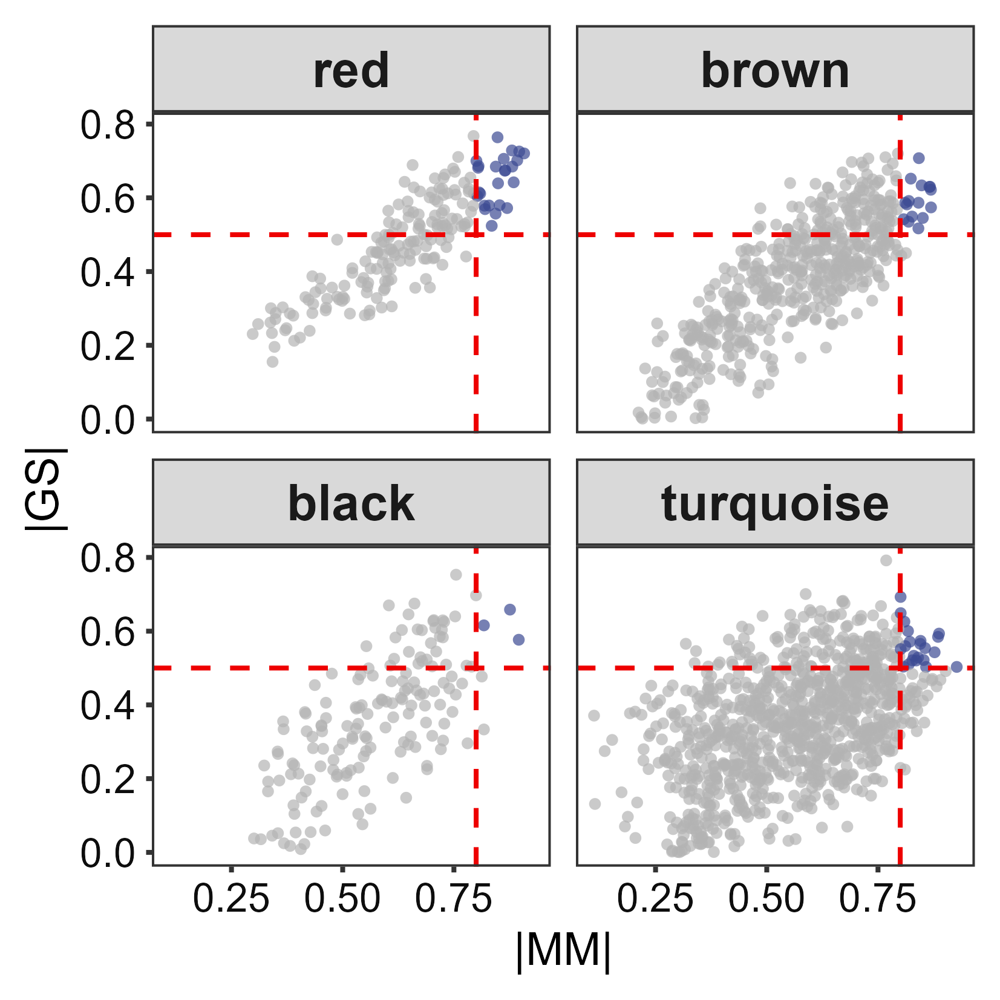

## Step 8: geo_genes: intersecting DEGs and WGCNA
```{r}
wgcna_genes_df <- wgcna_Genes[,"Gene"]
save(wgcna_genes_df, file =  "../data/processed/geo/gse57338_wgcna_genes.RData")

rm(list = ls())

load("../data/processed/geo/gse57338_degs_results.RData")
load("../data/processed/geo/gse57338_wgcna_genes.RData")

deg_genes <- rownames(deg_sig) 
wgcna_genes <- wgcna_genes_df$Gene 

# geo_genes: intersecting DEGs and WGCNA
geo_genes <- intersect(deg_genes,wgcna_genes)

deg_genes_df <- data.frame(Gene = deg_genes)

geo_genes_df <- data.frame(Gene = geo_genes) %>%
  arrange(Gene)

gene_list <- list(
  DEGs = deg_genes,
  `WGCNA Genes` = wgcna_genes
)

p <- ggvenn(
  gene_list,
  fill_color = pal_aaas()(2),
  stroke_color = "white",
  stroke_size = 1,
  set_name_size = 5,
  text_size = 5,
  text_color = "white",
  show_percentage = FALSE
) +
  theme(plot.title = element_text(hjust = 0.5, size=10))

# save
# ggsave("../main/figures/Figure_1G.pdf", p, width=6, height=6, dpi=300)
p


save(deg_genes_df, wgcna_genes_df,geo_genes_df, file = "../data/processed/geo/geo_genes.RData")

write.xlsx(
  list(
    DEGs = deg_genes_df,
    WGCNAGenes = wgcna_genes_df
  ),
  "../supplementary/tables/Table_S3.xlsx"
)

deg_candidate <- deg_sig[rownames(deg_sig) %in% geo_genes, ]

up_genes <- rownames(deg_candidate[ deg_candidate$significance =="Up(151)",])

down_genes <- rownames(deg_candidate[ deg_candidate$significance =="Down(162)",])

cat("Up genes: ", length(up_genes), "\n")
print(up_genes)

cat("\nDown genes: ", length(down_genes), "\n")
print(down_genes)
```

## Figure 1: magick
layout: A + B / C / D + (E/F)

```{r}
files <- c(
  "../main/figures/Figure_1A.png",
  "../main/figures/Figure_1B.png",
  "../main/figures/Figure_1C.png",
  "../main/figures/Figure_1D.png",
  "../main/figures/Figure_1E.png",
  "../main/figures/Figure_1F.png"
)

labels <- c("A", "B", "C", "D", "E", "F")

imgs <- list()
for (i in seq_along(files)) {
  img <- image_read(files[i])
  img <- image_annotate(
    img, 
    labels[i], 
    gravity = "northwest",  
    location = "+10+10",    
    size = 100,  # px, ~ 12pt
    weight = 700,    
    color = "black"
  )
  imgs[[i]] <- img
}

row1 <- image_append(c(imgs[[1]],imgs[[2]]), stack = FALSE)
row2 <- image_append(c(imgs[[3]]), stack = FALSE)
ef <- image_append(c(imgs[[5]],imgs[[6]]), stack = TRUE)
row3 <- image_append(c(imgs[[4]],ef), stack = FALSE)

p1 <- image_append(c(row1, row2, row3), stack = TRUE)

image_write(p1, "../main/figures/Figure_1.png", format = "png",depth =16)
```

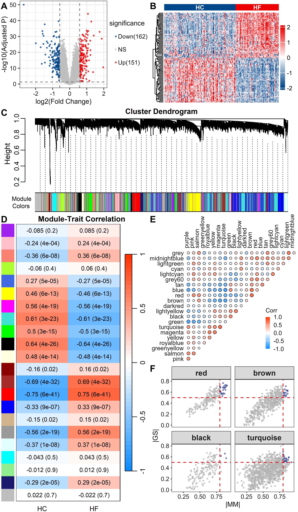


#  HERMES_DCM_genes

## HERMES_DCM_genes

https://www.nature.com/articles/s41467-023-39253-3

```{r}
# 1. 分类型基因列表存储
dcm_gene_list <- list(
  # 经典临床单基因致病基因
  classic_mendelian = c(
    "TTN", "BAG3", "FLNC", "LMNA", "LDB3", "MYPN", "NEXN", 
    "OBSCN", "VCL", "MYBPC3", "ALPK3", "FHOD3", "PRDM16"
  ),
  # 本文新发现罕见高风险致病基因(RVAS验证)
  novel_rare_causal = c("SSPN", "MAP3K7", "NEDD4L"),
  # GWAS多基因易感基因（按通路汇总全部62个效应基因）
  gwas_susceptible = c(
    # 肌小节/骨架
    "MYPN", "HSPB8", "ALPK3", "ACTN2", "SPATS2L", "MAPT", "MYL6", 
    "PDLIM5", "MTSS1", "STRN", "TMEM182", "PLN", "CSRP3", "SYNPO2L", 
    "MLIP", "TKT",
    # TGF-β/Wnt纤维化通路
    "BAMBI", "INHBB", "THBS1", "CAMK2D", "MAP3K7", "NEDD4L", 
    "NFATC1", "PRKCA", "RNF207",
    # 蛋白稳态/热休克/内质网应激
    "HSPA4", "HSPB7", "HSPB8", "BAG3", "FBXO32", "DNAJC18", 
    "CRYAB", "DERL3",
    # 基质黏附
    "COL4A1", "ITGA5", "EPHB1", "THBS1", "PDLIM5", "SSPN",
    # 离子通道/心脏转录因子
    "PITX2", "KCNIP2", "SLC6A6", "MITF", "GATA4",
    # 代谢线粒体其他
    "CHCHD10", "DMPK", "SLC6A6", "RRAS2", "FOXN3", "CDKN1A", 
    "PROM1", "HLF"
  )
)

# 2. 转为data.frame表格，用于查看、导出csv
# 拆分为长格式表格
dcm_gene_df <- bind_rows(
  tibble(
    gene_category = "经典孟德尔单基因致病",
    gene_symbol = dcm_gene_list$classic_mendelian
  ),
  tibble(
    gene_category = "本研究新发现罕见致病基因",
    gene_symbol = dcm_gene_list$novel_rare_causal
  ),
  tibble(
    gene_category = "GWAS多基因易感效应基因",
    gene_symbol = dcm_gene_list$gwas_susceptible
  )
)

# 查看表格
print(dcm_gene_df, n = Inf)

# 导出CSV（可选）
# write.csv(dcm_gene_df, "DCM_NatureGenes_2024.csv", row.names = F)

# 3. 按通路拆分单独数据框（如需通路注释）
pathway_gene <- list(
  sarcomere_cytoskeleton = c("MYPN", "HSPB8", "ALPK3", "ACTN2", "SPATS2L", "MAPT", "MYL6", "PDLIM5", "MTSS1", "STRN", "TMEM182", "PLN", "CSRP3", "SYNPO2L", "MLIP", "TKT"),
  tgf_wnt_fibrosis = c("BAMBI", "INHBB", "THBS1", "CAMK2D", "MAP3K7", "NEDD4L", "NFATC1", "PRKCA", "RNF207"),
  protein_homeostasis = c("HSPA4", "HSPB7", "HSPB8", "BAG3", "FBXO32", "DNAJC18", "CRYAB", "DERL3"),
  cell_adhesion_matrix = c("COL4A1", "ITGA5", "EPHB1", "THBS1", "PDLIM5", "SSPN"),
  ion_channel_transcription = c("PITX2", "KCNIP2", "SLC6A6", "MITF", "GATA4"),
  metabolism_mitochondria = c("CHCHD10", "DMPK", "SLC6A6", "RRAS2", "FOXN3", "CDKN1A", "PROM1", "HLF")
)
```

## all hermes_dcm_genes 
```{r}
hermes_dcm_genes <- c(
  # 经典孟德尔单基因致病
  "TTN", "BAG3", "FLNC", "LMNA", "LDB3", "MYPN", "NEXN", "OBSCN", "VCL", "MYBPC3", "ALPK3", "FHOD3", "PRDM16",
  # 本研究新发现罕见致病基因
  "SSPN", "MAP3K7", "NEDD4L",
  # GWAS去重易感基因（剔除和上面重复的）
  "ACTN2", "SPATS2L", "MAPT", "MYL6", "PDLIM5", "MTSS1", "STRN", "TMEM182", "PLN", "CSRP3", "SYNPO2L", "MLIP", "TKT",
  "BAMBI", "INHBB", "THBS1", "CAMK2D", "NFATC1", "PRKCA", "RNF207",
  "HSPA4", "HSPB7", "FBXO32", "DNAJC18", "CRYAB", "DERL3",
  "COL4A1", "ITGA5", "EPHB1",
  "PITX2", "KCNIP2", "SLC6A6", "MITF", "GATA4",
  "CHCHD10", "DMPK", "RRAS2", "FOXN3", "CDKN1A", "PROM1", "HLF"
)
```

## review_genes 

https://pmc.ncbi.nlm.nih.gov/articles/PMC13122708/

```{r}
review_genes <- c(
  "TTN", "MYH7", "TNNT2",
  "LMNA", "EMD",
  "SCN5A", "CACNA1C", "RYR2",
  "DSC2", "DSP",
  "RBM20", "KLF13", "ETS1", "BMP10"
)
```

# clinGen
```{r}
clinGen <- c(
  "ACTC1", "ACTN2", "BAG3", "BAG5", "DES", "DSP", "FLII", "FLNC",
  "JPH2", "LDB3", "LMNA", "LMOD2", "MYH7", "MYLK3", "MYZAP", "NKX2-5",
  "NEXN", "NRAP", "PLN", "PPA2", "PLEKHM2", "PPP1R13L", "PRDM16", "RBM20",
  "RPL3L", "SCN5A", "TBX20", "TNNI3", "TNNI3K", "TNNC1", "TNNT2", "TPM1",
  "TTN", "VCL"
)
```

# dcm_all_51_genes

https://www.ahajournals.org/doi/10.1161/CIRCULATIONAHA.120.053033

```{r}
dcm_all_51_genes <- c(
  "ABCC9", "ACTC1", "ACTN2", "ANKRD1", "BAG3", "CSRP3", "DES",
  "DMD", "DNAJC19", "DSP", "ELAC2", "EMD", "FLNC", "GATAD1",
  "HCN4", "ILK", "JPH2", "LAMA4", "LMNA", "MIB1", "MYH6", "MYH7",
  "MYPN", "NEXN", "NKX2-5", "PDLIM3", "PKP2", "PLN", "RBM20",
  "SCN5A", "SDHA", "SGCD", "TGFB3", "TMEM43", "TNNC1", "TNNI3",
  "TNNT2", "TPM1", "TTN", "VCL", "LDB3", "TMPO", "EYA4", "PSEN1",
  "PSEN2", "CRYAB", "HSPB8", "LMNB1", "OPA1", "PRKAG2", "RAB3GAP2"
)
```

##  DCM-CHF-related genes
```{r}
load("../data/processed/geo/gse57338_degs_results.RData")
load("../data/processed/geo/gse57338_wgcna_genes.RData")

disease_genes <- Reduce(union, list(rownames(deg_sig), wgcna_genes_df$Gene, hermes_dcm_genes, dcm_all_51_genes,clinGen,review_genes))

disease_genes_df <- data.frame(Gene = disease_genes)

save(disease_genes_df, 
     file = "../data/processed/10_disease_genes_df.RData")
```
