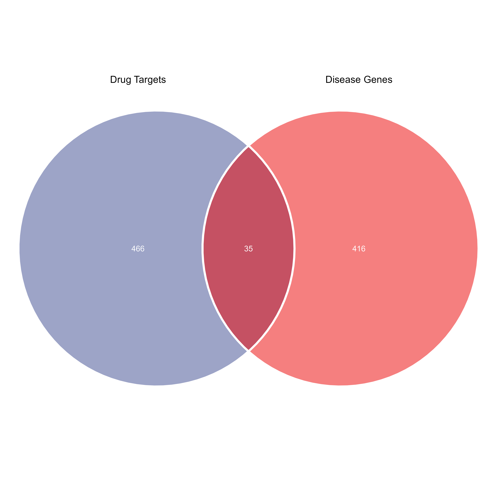

```{r setup, include=FALSE, warning=FALSE}
if (!requireNamespace("knitr", quietly = TRUE)) install.packages("knitr", dependencies = TRUE)

knitr::opts_chunk$set(
  echo = TRUE,
  warning = FALSE,
  message = FALSE,
  fig.dpi = 300,
  fig.align = "center"
)

options(timeout = 36000)
options(stringsAsFactors = FALSE)
options(download.file.method = "curl")
options(download.file.extra = "-k -L")

options(BioC_mirror = "https://mirrors.tuna.tsinghua.edu.cn/bioconductor")
options(repos = c(CRAN = "https://mirrors.tuna.tsinghua.edu.cn/CRAN/"))
```

# Load packages {-}
```{r}
library(tidyverse)
library(data.table)
library(openxlsx)

library(clusterProfiler)
library(igraph)
library(centiserve)
library(RCy3)
library(org.Hs.eg.db)

library(ggvenn)
library(ggsci)
library(cowplot)
library(patchwork)
```

# Candidate genes
## Load data
```{r}
rm(list = ls())

load("../data/processed/10_disease_genes_df.RData")
load("../data/processed/09_herb_compound_target.RData")
```

## Candidate genes
```{r}
candidate_genes <- intersect(herb_compound_target$Symbol, disease_genes_df$Gene)

candidate_genes_df <- data.frame(Gene = candidate_genes)

save(candidate_genes_df,file ="../data/processed/11_candidate_genes.RData")

```

## Figure 2A
```{r}
gene_list <- list(
  `Drug Targets` = herb_compound_target$Symbol,
  `Disease Genes` = disease_genes_df$Gene
)

p2A <- ggvenn(
  gene_list,
  fill_color = pal_aaas()(2),
  stroke_color = "white",
  stroke_size = 1,
  set_name_size = 3.5,
  text_size = 2.8,
  text_color = "white",
  show_percentage = FALSE,
  show_elements = FALSE
) +
  theme(
    plot.title = element_text(hjust = 0.5, size=10)
  ) + 
  scale_x_continuous(limits = c(-1.8, 1.8), expand = c(0, 0)) +
  scale_y_continuous(limits = c(-1.8, 1.8), expand = c(0, 0))

# p2A

# save
ggsave("../main/figures/Figure_2A.png", p2A, width=7, height=7, dpi=600)

write.xlsx(candidate_genes_df, file = "../supplementary/tables/Table_S4.xlsx")
```



# Herb-Compound-Target Network (HCT Network)

## Step 1: HCT data
```{r}
rm(list = ls())

load("../data/processed/09_herb_compound_target.RData")
load("../data/processed/11_candidate_genes.RData")

hct_df <- herb_compound_target %>%
  dplyr::filter(Symbol %in% candidate_genes_df$Gene) %>%
  dplyr::select(`Medicinal.materials(Chinese.Pinyin.name)`,CID, Symbol) %>%
  dplyr:: rename(Herb = `Medicinal.materials(Chinese.Pinyin.name)`, 
                 Compound = CID,
                 Target = Symbol)  %>%
  distinct() %>%
  arrange(Herb,Target)

cat("\nHerbs: ", paste(unique(hct_df$Herb), collapse = ", "), "\n")

cat("Number of Compounds", length(unique(hct_df$Compound)), "\n")

cat("Number of Targets", length(unique(hct_df$Target)), "\n")

save(hct_df,file = "../data/processed/12_herb_compound_target_network.RData")
```

## Step 2: Build herb-compound-target network
```{r}
herb_compound <- hct_df %>%
  dplyr::select(Herb, Compound) %>%
  distinct()
  
compound_target <- hct_df %>%
  dplyr::select(Compound, Target) %>%
  distinct()

compound_herbs <- herb_compound %>%
  group_by(Compound) %>%
  summarise(Herbs = paste(unique(Herb), collapse = ","), .groups = "drop")

target_herbs <- compound_target %>%
  left_join(compound_herbs, by = "Compound") %>%
  group_by(Target) %>%
  summarise(Herbs = paste(unique(unlist(strsplit(Herbs, ","))), collapse = ","), .groups = "drop")
  
# edges
edges <- bind_rows(
  herb_compound %>% 
    dplyr::rename(source = Herb, target = Compound) %>% 
    mutate(interaction = "herb_compound"),
  compound_target %>%
    dplyr::rename(source = Compound, target = Target) %>%
    mutate(interaction = "compound_target")
)

# nodes
nodes <- data.frame(id = unique(c(edges$source, edges$target))) %>%
  mutate(type = case_when(
    id %in% herb_compound$Herb        ~ "Herb",
    id %in% compound_target$Compound  ~ "Compound",
    id %in% compound_target$Target    ~ "Target",
    TRUE                              ~ "Other"
  ),
    Group = case_when(
      type == "Herb"     ~ id,                           
      type == "Compound" ~ compound_herbs$Herbs[match(id, compound_herbs$Compound)],
      type == "Target"   ~ "Target",
      TRUE               ~ NA_character_
    )
)

save(nodes,edges,file = "../data/processed/13_hct_network_data.RData")
```

## Figure_2B. HIT network.

```{r}
rm(list = ls())

load("../data/processed/13_hct_network_data.RData")

cytoscapePing()  

deleteAllNetworks() 

createNetworkFromDataFrames(
  nodes = nodes,
  edges = edges,
  title = "HCT_Network",
  collection = "HCT_Network"
)

# layout
layoutNetwork("force-directed")

# style
style_name <- "HCT_Style_By_Nodes_Type"
try(deleteVisualStyle(style_name), silent = TRUE)

# default style
defaults <- list(
  NODE_SHAPE = "RECTANGLE",
  NODE_SIZE = 30,
  NODE_FILL_COLOR = "#CCCCCC",
  NODE_LABEL_FONT_FACE = "Arial,plain,12",
  EDGE_WIDTH = 0.5,
  EDGE_STROKE_COLOR = "#E0E0E0",
  EDGE_TRANSPARENCY = 200         
)

# mapping style
mappings <- list(
  # node shape
  mapVisualProperty(
    visual.prop = 'node shape', 
    table.column = 'type', 
    mapping.type = 'd',
    table.column.values = c("Herb", "Compound", "Target"),
    visual.prop.values = c("DIAMOND","ELLIPSE", "RECTANGLE")
  ),
  
  # node color
  mapVisualProperty(
    visual.prop = 'node fill color', 
    table.column = 'type', 
    mapping.type = 'd',
    table.column.values = c("Herb", "Compound", "Target"),
    visual.prop.values = c("green", "red", "blue")
  ),
  
  # node size
  mapVisualProperty(
    visual.prop = 'node size',
    table.column = 'type',
    mapping.type = 'd',
    table.column.values = c("Herb", "Compound", "Target"),
    visual.prop.values = c(30, 20, 30)
  ),
  
  # node label
  mapVisualProperty(
    visual.prop = 'node label', 
    table.column = 'name', 
    mapping.type = 'p'
  ),
  
  mapVisualProperty(
    visual.prop = 'node label color', 
    table.column = 'type', 
    mapping.type = 'd',
    table.column.values = c("Herb", "Compound", "Target"),
    visual.prop.values = c("#000000", "#000000", "#000000")
  )
)

# apply style
createVisualStyle(
  style.name = style_name, 
  defaults = defaults, 
  mappings = mappings
)

setVisualStyle(style_name)

# Figure_2B.pdf / Figure_2B.png
```


## Step 4: Degree
```{r}
hct_cytohubba <- read.csv("../results/hct_cytohubba.csv")

herb_degree <- hct_cytohubba[1:2,c("node_name","Degree")] %>%
  arrange(desc(Degree))
herb_degree

compound_degree <- hct_cytohubba[3:27,c("node_name","Degree")] %>%
  arrange(desc(Degree))
compound_degree

target_degree <- hct_cytohubba[28:nrow(hct_cytohubba),c("node_name","Degree")] %>%
  arrange(desc(Degree))
target_degree

save(hct_cytohubba, target_degree, compound_degree, herb_degree, file = "../data/processed/14_hct_degree.RData" )
```

# PPI network
```{r}
rm(list = ls())

# score >=0.4 --> 0.7
ppi_list <- fread("../data/raw/string/string_interactions_short.tsv") %>%
  dplyr::select(`#node1`, node2, combined_score) %>%
  dplyr::filter(combined_score >= 0.4) %>% 
  dplyr::rename(source = `#node1`, target = node2, score = combined_score)

save(ppi_list,file = "../data/processed/15_ppi_list.RData")
```

## Step 2: PPI network visualization
```{r}
# Ping Cytoscape 
cytoscapePing() 

try(deleteNetwork("PPI_Network"), silent = TRUE)
deleteAllNetworks() 

createNetworkFromDataFrames(
  edges = ppi_list,
  title = "PPI_Network", 
  collection = "PPI_Network" 
)

nodes <- data.frame(id = unique(c(ppi_list$source, ppi_list$target)))
nodes$degree <- sapply(nodes$id, function(x) {
  sum(ppi_list$source == x | ppi_list$target == x)
})

# Create based on degree values, node attributes must be synchronized into Cytoscape first

loadTableData(nodes, data.key.column = "id", table = "node")

# New style
try(deleteVisualStyle("PPI_Style_By_Nodes_Degree"), silent = TRUE)
style_name <- "PPI_Style_By_Nodes_Degree"

# default style
default_lists <- list(
  NODE_SHAPE = "ellipse",           
  NODE_SIZE = 50,                   
  NODE_FILL_COLOR = "#88CCEE",      
  # NODE_LABEL_FONT_SIZE = 12,
  NODE_LABEL_FONT_FACE = "Arial,plain,12",  
  EDGE_WIDTH = 0.5,
  EDGE_STROKE_COLOR = "#E0E0E0",
  EDGE_TRANSPARENCY = 200          
)

# getVisualPropertyNames()
mapping_lists <- list(
  # Node size: small degree → 20, large degree → 100
  # mapVisualProperty(
  #   visual.prop = 'NODE_SIZE', 
  #   table.column = 'degree', 
  #   mapping.type = 'c',  
  #   table.column.values = c(min(nodes$degree), max(nodes$degree)), 
  #   visual.prop.values = c(20, 100)
  # ),
  # Node fill color mapping: small degree → light yellow, large degree → red
  mapVisualProperty(
    visual.prop = 'NODE_FILL_COLOR', 
    table.column = 'degree', 
    mapping.type = 'c',
    table.column.values = c(min(nodes$degree), max(nodes$degree)),
    visual.prop.values = c("#ecddbb", "#cd6767")
  ),
  
  mapVisualProperty(
    visual.prop = 'EDGE_WIDTH',        
    table.column = 'score',            
    mapping.type = 'c',                
    table.column.values = c(min(ppi_list$score), max(ppi_list$score)),      
    visual.prop.values = c(1, 8)     
  ),
  
  mapVisualProperty(
    visual.prop = 'EDGE_STROKE_UNSELECTED_PAINT',   
    table.column = 'score',              
    mapping.type = 'c',                  
    table.column.values = c(min(ppi_list$score), max(ppi_list$score)),
    visual.prop.values = c("#c2c5ce", "#3b4360")  
  )
)

createVisualStyle(
  style.name = style_name,
  defaults = default_lists,
  mappings = mapping_lists
)

setVisualStyle(style_name)

# Node Label
setNodeLabelMapping(table.column = 'id', style.name = style_name)

layoutNetwork("force-directed")
```

## Figure 3C: PPI network


# Identification of Hub Genes

- input: cytohubba_res.csv

## Step 1: Cytohubba
```{r}
rm(list = ls())

cytohubba_res <- read_csv("../results/ppi_cytohubba.csv") %>%
  column_to_rownames(var = colnames(.)[1])

# cytohubba
top_n <- 10
n <- min(top_n, nrow(cytohubba_res))

top_mcc <- rownames(cytohubba_res[order(cytohubba_res$MCC, decreasing = TRUE), ])[1:n]

top_degree <- rownames(cytohubba_res[order(cytohubba_res$Degree,decreasing = T),])[1:n]

top_mnc <- rownames(cytohubba_res[order(cytohubba_res$MNC,decreasing = T),])[1:n]

cytohubba_genes <- Reduce(intersect, list(top_mcc, top_degree, top_mnc))

cytohubba_genes
```

## Figure 3D

- input: Figure_3D_a, Figure_3D_b,Figure_3D_c
```{r}
# Figure 3D_d
gene_list <- list(
  MCC = top_mcc,
  MNC = top_mnc,
  Degree = top_degree
)

p <- ggvenn(
  gene_list,
  fill_color = pal_aaas()(3),
  stroke_color = "white",
  stroke_size = 0.5,
  set_name_size = 2.5,
  text_size = 2.5,
  text_color = "white",
  show_percentage = FALSE
) +
  theme(plot.title = element_text(hjust = 0.5, size=4))

ggsave("../main/figures/Figure_3D_d.pdf", p, width=1.38, height=1.38, units="in", dpi=300)

# Figure 4B
total_width_cm <- 7        
dpi <- 300                    
px_per_cm <- dpi / 2.54  

files <- c(
  "../main/figures/Figure_3D_a.pdf",
  "../main/figures/Figure_3D_b.pdf",
  "../main/figures/Figure_3D_c.pdf",
  "../main/figures/Figure_3D_d.pdf"
)

labels <- c("a", "b", "c", "d")

label_size <- 8   

pdfs <- list()
for (i in seq_along(files)) {
  img <- image_read_pdf(files[i], density = 300)
  img <- image_annotate(img, labels[i], 
                        gravity = "northeast",  
                        location = "+5+5",    
                        size = label_size,     
                        weight = 700,    
                        color = "black")
  pdfs[[i]] <- img
}

row1 <- image_append(c(pdfs[[1]], pdfs[[2]]), stack = FALSE)
row2 <- image_append(c(pdfs[[3]], pdfs[[4]]), stack = FALSE)

combined <- image_append(c(row1, row2), stack = TRUE)


image_write(combined, "../main/figures/Figure_3D.pdf", format = "pdf")
# image_write(combined, "../main/figures/Figure_3D.png", format = "png", density = dpi)
```

## Step 2: MCODE
```{r}
mcode_genes <- data.table::fread("../results/ppi_mcode.txt") 

mcode_genes <- unique(unlist(strsplit(mcode_genes$`Node IDs`, ", ")))
```

## Step 3: hub_genes
```{r}
# unicon
hub_genes <- union(cytohubba_genes,mcode_genes)
hub_genes_df <- cytohubba_res[rownames(cytohubba_res) %in% hub_genes, c("MCC","MNC","Degree")] %>%
    rownames_to_column("Gene") 

hub_genes_df

hub_genes <- hub_genes_df$Gene

hub_genes


save(hub_genes_df,hub_genes,file = "../data/processed/16_hub_genes.RData")

write.xlsx(
  list(hub_genes = hub_genes_df),
  "../supplementary/tables/Table_S5.xlsx"
)
```


# Figure 3
```{r}
total_width_cm <- 14        
dpi <- 300                    
px_per_cm <- dpi / 2.54     
total_width_px <- round(total_width_cm * px_per_cm) 

ratios_row1 <- c(1, 1)
ratios_row2 <- c(1, 1)  

width_row1_left  <- round(total_width_px * ratios_row1[1] / sum(ratios_row1))
width_row1_right <- round(total_width_px * ratios_row1[2] / sum(ratios_row1))
width_row2_left  <- round(total_width_px * ratios_row2[1] / sum(ratios_row2))
width_row2_right <- round(total_width_px * ratios_row2[2] / sum(ratios_row2))

ratio <- c(width_row1_left,width_row1_right,width_row2_left,width_row2_right)

files <- c(
  "../main/figures/Figure_3A.pdf",
  "../main/figures/Figure_3B.pdf",
  "../main/figures/Figure_3C.pdf",
  "../main/figures/Figure_3D.pdf"
)

labels <- c("A", "B", "C", "D")

label_size <- 12   

pdfs <- list()
# for (i in seq_along(files)) {
#   img <- image_read_pdf(files[i], density = 300)
#   # img <- image_read(files[i])  
#   img <- image_resize(img,ratio[i])
#   img <- image_annotate(img, labels[i], 
#                         gravity = "northwest",  
#                         location = "+10+10",    
#                         size = label_size,     
#                         weight = 700,    
#                         color = "black")
#   pdfs[[i]] <- img
# }

for (i in seq_along(files)) {
  ext <- tolower(tools::file_ext(files[i]))   
  img <- switch(ext,
    pdf = {
      image_read_pdf(files[i], density = 300)
    },
    svg = {
      image_read_svg(files[i], width = ratio[i])
    },
    png = , jpg = , jpeg = {
      image_read(files[i])
    },
    stop("Unsupported file format: ", ext)
  )
  
  img <- image_resize(img, paste0(ratio[i], "x"))

  img <- image_annotate(img, labels[i], 
                        gravity = "northwest", 
                        location = "+10+10",
                        size = label_size,
                        weight = 700,
                        color = "black")
  pdfs[[i]] <- img
}

row1 <- image_append(c(pdfs[[1]], pdfs[[2]]), stack = FALSE)
row2 <- image_append(c(pdfs[[3]], pdfs[[4]]), stack = FALSE)

combined <- image_append(c(row1, row2), stack = TRUE)

image_write(combined, "../main/figures/Figure_3.pdf", format = "pdf")
# image_write(combined, "../main/figures/Figure_3.png", format = "png", density = dpi)
```
