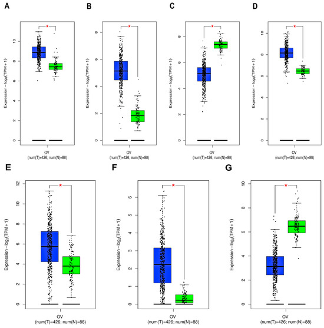

```{r setup, include=FALSE, warning=FALSE}
knitr::opts_chunk$set(
  echo = TRUE,
  warning = FALSE,
  message = FALSE,
  fig.dpi = 300,
  fig.align = "center"
)

options(timeout = 36000)
options(stringsAsFactors = FALSE)
options(download.file.method = "curl")
options(download.file.extra = "-k -L")

options(BioC_mirror = "https://mirrors.tuna.tsinghua.edu.cn/bioconductor")
options(repos = c(CRAN = "https://mirrors.tuna.tsinghua.edu.cn/CRAN/"))
```

# Main

## Figures

### Figure 1.

::: {#fig-medicinal-network}



Medicinal plants–Hematogenous active compounds–Potential targets network. Green diamond represents medicinal plants, red circle represents the blood-absored active compounds, purple circles represent targets.
:::


::: {#suppfig-1}


Medicinal plants.
:::

### Figure 3.

### Figure 4.

### Figure 5.

### Figure 6.

### Figure 7.

### Figure 8.

### Figure 9.

## Tables

### Table 1.

### Table 2.

### Table 3.

### Table 4.

### Table 5.


# Supplementary

## Figures
### Figure S1.

### Figure S2.

### Figure S3.

### Figure S4.

### Figure S5.

### Figure S6.


## Tables

### Table S1.

### Table S2.

### Table S3.

### Table S4.

### Table S5.

### Table S6.

### Table S7.

### Table S8.

### Table S9.

### Table S10.

### Table S11.
