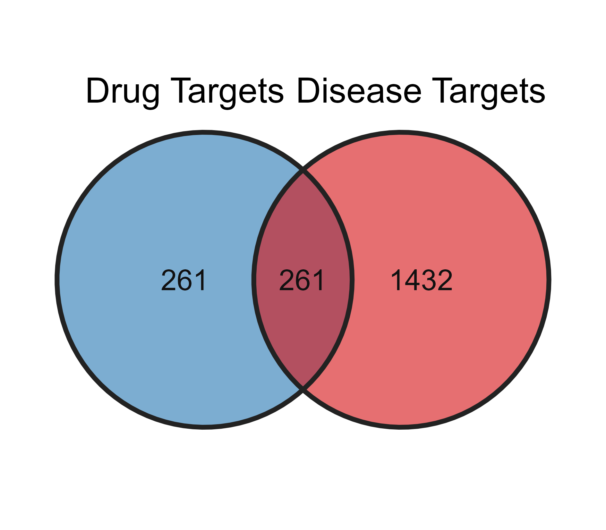
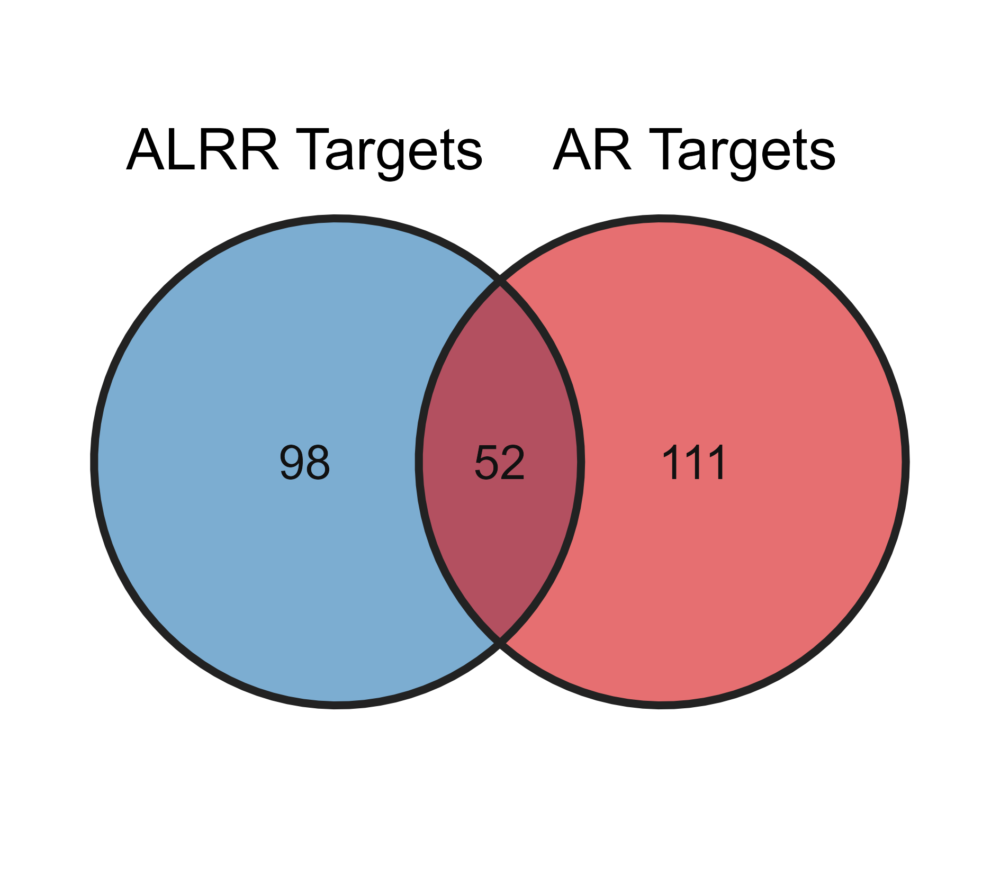

```{r setup, include=FALSE}
knitr::opts_chunk$set(echo = TRUE, fig.width=8, fig.height=6, dpi=300)
library(tidyverse)
library(openxlsx)
library(data.table)
library(rmdwc)
# remotes::install_github("sigbertklinke/rmdwc", dependencies = TRUE)

library(future)     
library(furrr)      
library(progressr) 
library(httr) 

library(ggplot2)
library(ggsci)
library(ggpubr)
library(ggvenn)

library(patchwork)
library(cowplot)
library(magick)

library(clusterProfiler)
library(AnnotationDbi)
library(org.Hs.eg.db)
library(enrichplot)
library(KEGGREST)

library(RCy3)
library(igraph)
library(ggraph)
library(corrplot)
library(pheatmap)
library(ComplexHeatmap)
library(circlize)

library(HPAanalyze)

library(GEOquery)
library(AnnoProbe)
# remotes::install_github("jmzeng1314/AnnoProbe", dependencies = TRUE)
library(sva)
library(limma)
library(IOBR)
# remotes::install_github("IOBR/IOBR", dependencies = TRUE)

options(download.file.method = "curl")
Sys.unsetenv("CURL_CA_BUNDLE")
Sys.setenv(R_LIBCURL_SSL_REVOKE_BEST_EFFORT = "TRUE")
```


---

# 活性成分鉴定与靶点收集

(1) 目的: 揭示两药互补的化学与靶标基础。

(2) 预期结果: 从QFD含药血清中鉴定出数十个入血活性成分（属于AR和ALRP）；分别获得AR特异性靶点、ALRP特异性靶点及两者共享靶点。

(3) 结果解析: 两药既有共同的作用靶标，又各有独特的作用谱，从分子起始端就展现出“同中有异、相互补充”的配伍特征。

## 方法描述


## 结果图表

### 活性成分表
```{r}
rm(list = ls())

ingredients <- read.xlsx("supplementary/Table S1.xlsx")

cat("活性成分总数: ", nrow(ingredients),"\n")

cat("附子活性成分数: ", sum(ingredients$Abbreviation=="ALRP"),"\n")

cat("黄芪活性成分数: ", sum(ingredients$Abbreviation=="AR"),"\n")
```

### 成分靶点表
```{r}
ingredients.targets <- read.xlsx("supplementary/Table S2.xlsx")

cat("潜在的成分靶点数: ", length(unique(ingredients.targets$Symbol)),"\n")

ingredients.targets.alrp <- ingredients.targets |>
  dplyr::filter(Abbreviation=="ALRP")

cat("附子成分数: ",
    length(unique(ingredients.targets.alrp$PubChem.CID)),
    "附子靶点数",
    length(unique(ingredients.targets.alrp$Symbol)),
    "\n")


ingredients.targets.ar <- ingredients.targets |>
  dplyr::filter(Abbreviation=="AR")

cat("黄芪成分数: ",
    length(unique(ingredients.targets.ar$PubChem.CID)),
    "黄芪靶点数",
    length(unique(ingredients.targets.ar$Symbol)),
    "\n")
```

## 结果描述


# 疾病靶点获取与候选治疗靶点筛选

(1) 目的: 锁定与疾病直接关联的核心靶标群。

(2) 预期结果: 通过QFD靶点与CHF疾病靶点的取交集，获得一组数量适中、高度富集于心力衰竭病理环节的候选治疗靶点。

(3) 结果解析: 交集靶点集是解释QFD治疗CHF的直接分子基础，排除了大量非疾病相关噪音，为后续分析聚焦。

## 方法描述


### 疾病靶点

- 从公共数据库`DisGeNET`, `GeneCards`, `TTD`（关键词: "chronic heart failure","heart failure"下载CHF靶点(supplementary/Table S3.xlsx)

```{r}
disease.targets <- read.xlsx("supplementary/Table S3.xlsx")

cat("CHF相关靶点数: ", nrow(disease.targets), "\n")
```

### 候选治疗靶点

- 交集靶点(supplementary/Table S4.xlsx)
```{r}
# overlapping_target <- read.xlsx("supplementary/Table S4.xlsx")

overlapping.targets <- data.frame(Symbol = intersect(disease.targets$Symbol, ingredients.targets$Symbol)) |>
  left_join(ingredients.targets,by = "Symbol") |>
  distinct(Abbreviation,Symbol)  |>
  group_by(Symbol) |>
  summarise(
    Source = paste(Abbreviation, collapse = ";"),
    .groups = "drop"
  ) |>
  dplyr::select(Abbreviation = Source, Symbol) |>
  arrange(Abbreviation)

cat("治疗靶点总数: ", nrow(overlapping.targets), "\n")

common.targets <- overlapping.targets |>
  dplyr::filter(Abbreviation == "ALRP;AR")
cat("共有靶点数: ",nrow(common.targets),"\n")

alrp.unique.targets <- overlapping.targets |>
  dplyr::filter(Abbreviation == "ALRP")
cat("附子特有靶点数: ",nrow(alrp.unique.targets), "\n")

ar.unique.targets <- overlapping.targets |>
  dplyr::filter(Abbreviation == "AR")
cat("黄芪特有靶点数: ",nrow(ar.unique.targets), "\n")

overlapping.targets.alrp <- ingredients.targets |>
  dplyr::filter(Abbreviation=="ALRP" & Symbol %in% overlapping.targets$Symbol) 

cat("附子成分数: ",
    length(unique(overlapping.targets.alrp$PubChem.CID)),
    "附子靶点数",
    length(unique(overlapping.targets.alrp$Symbol)),
    "\n")


overlapping.targets.ar <- ingredients.targets |>
  dplyr::filter(Abbreviation=="AR" & Symbol %in% overlapping.targets$Symbol) 

cat("黄芪成分数: ",
    length(unique(overlapping.targets.ar$PubChem.CID)),
    "黄芪靶点数",
    length(unique(overlapping.targets.ar$Symbol)),
    "\n")

save(
  overlapping.targets,
  common.targets,
  alrp.unique.targets,
  ar.unique.targets,
  overlapping.targets.alrp,
  overlapping.targets.ar,
  file = "../data/network/all.targets.RData"
)


write.xlsx(overlapping.targets, file = "supplementary/Table S4.xlsx")
```

## 结果图表
### 韦恩图：QFD成分靶点与CHF疾病靶点的
```{r}
venn_list_1a <- list(
  `Drug Targets` = unique(ingredients.targets$Symbol),
  `Disease Targets` = unique(disease.targets$Symbol)
)

p1a <- ggvenn(
  venn_list_1a,
  # MDPI专用柔和配色（低饱和，不刺眼，印刷友好）
  fill_color = c("#2c7bb6", "#d7191c"),
  fill_alpha = 0.62,
  stroke_color = "#222222",
  stroke_size = 0.85,
  set_name_size = 4.6,    # 分组标签字号
  text_size = 3.8,        # 交集数字字号
  text_color = "#111111",
  show_percentage = FALSE
) 

p1a

## 单列图: 宽度8 cm；双栏跨栏图: 宽度14 cm
# 单列推荐（绝大多数MDPI文章单栏放韦恩图）
width_cm  <- 8
height_cm <- 7

# 矢量PDF【首选，审稿/最终出版】
ggsave("main/Figure_1A_Venn.pdf",
       plot = p1a,
       width = width_cm,
       height = height_cm,
       units = "cm",
       dpi = 600)

# TIFF 600 dpi（部分编辑要求位图）
ggsave("main/Figure_1A_Venn.tiff",
       plot = p1a,
       width = width_cm,
       height = height_cm,
       units = "cm",
       dpi = 600,
       compression = "lzw")

# PNG 600 dpi
ggsave("main/Figure_1A_Venn.png",
       plot = p1a,
       width = width_cm,
       height = height_cm,
       units = "cm",
       dpi = 600)
```


### 韦恩图：附子靶点与黄芪靶点
```{r}
venn_list_1b <- list(
  `ALRR Targets` = unique(overlapping.targets.alrp$Symbol),
  `AR Targets` = unique(overlapping.targets.ar$Symbol)
)

p1b <- ggvenn(
  venn_list_1b,
  fill_color = c("#2c7bb6", "#d7191c"),
  fill_alpha = 0.62,
  stroke_color = "#222222",
  stroke_size = 0.85,
  set_name_size = 4.6,    
  text_size = 3.8,      
  text_color = "#111111",
  show_percentage = FALSE
) 

p1b

## 单列图: 宽度8 cm；双栏跨栏图: 宽度14 cm
# 单列推荐（绝大多数MDPI文章单栏放韦恩图）
width_cm  <- 8
height_cm <- 7

# 矢量PDF【首选，审稿/最终出版】
ggsave("main/Figure_1B_Venn.pdf",
       plot = p1b,
       width = width_cm,
       height = height_cm,
       units = "cm",
       dpi = 600)

# TIFF 600 dpi（部分编辑要求位图）
ggsave("main/Figure_1B_Venn.tiff",
       plot = p1b,
       width = width_cm,
       height = height_cm,
       units = "cm",
       dpi = 600,
       compression = "lzw")

# PNG 600 dpi（部分编辑要求位图）
ggsave("main/Figure_1B_Venn.png",
       plot = p1b,
       width = width_cm,
       height = height_cm,
       units = "cm",
       dpi = 600)
```


::: {#fig1}



图1	活性成分靶点与疾病靶点的鉴定与交集。（A）QFD成分靶点与CHF疾病靶点的韦恩图；（B）AR与ALRP潜在靶点的韦恩图。
:::

## 结果描述

# PPI网络与核心Hub基因筛选

(1) 目的: 筛选出协同调控的中枢分子。

(2) 预期结果: 

- 构建的PPI网络具有明显的聚集模块（MCODE模块），对应不同的生物功能。

- 基于度、介数和MCC三重拓扑指标，鉴定出10个核心Hub基因（如AKT1、TNF、IL6、VEGFA、TP53、STAT3、EGFR、CASP3、PTEN、HIF1A等，实际由分析得出）。

- 这些Hub基因被明确标注为`AR-driven`, `ALRP‑driven`, `Co-driven`，即部分主要由某一药对驱动，部分则由两药共同驱动。

(3) 结果解析: 网络的中枢节点同时受到来自两药成分的调控，这从网络拓扑层面提供了“多点协同、网络协同”的最直接证据——关键靶标在微观上实现了“1+1>2”的协同增效。

### cytohubba
```{r}
cytohubba <- read.csv("../data/network/cytohubba.csv")

mcc <- cytohubba |>
  dplyr::select(MCC,node_name) |>
  arrange(desc(MCC)) 

mcc_top15 <- mcc[1:15,]$node_name

degree <- cytohubba |>
  dplyr::select(Degree,node_name) |>
  arrange(desc(Degree)) 

degree_top15 <- degree[1:15,]$node_name

betweenness <- cytohubba |>
  dplyr::select(Betweenness,node_name) |>
  arrange(desc(Betweenness)) 

betweenness_top15 <- betweenness[1:15,]$node_name

hub_gene <- Reduce(intersect, list(mcc_top15, degree_top15, betweenness_top15))
```

### MCODE
```{r}
mcode <- fread("../data/network/mcode.txt")

mcode$Nodes[1] <- "AKT1,
BCL2,
CASP3,
CXCL8,
EGFR,
FOXO1,
FOXO3,
HDAC1,
HSP90AA1,
HSP90AB1,
IL1B,
IL6,
JUN,
MAPK1,
MAPK14,
MMP9,
MYC,
NFKB1,
NFKBIA,
PTGS2,
SIRT1,
TGFB1,
TNF,
TP53"

mcode1 <- trimws(strsplit(mcode$Nodes[1], ",")[[1]]) 
```

### Hub Gene
```{r}
hub_gene2 <- union(hub_gene,mcode1)

ingredients.targets <- read.xlsx("supplementary/Table S2.xlsx")

alrp.hub.targets <- ingredients.targets |>
  dplyr::filter(Abbreviation == "ALRP" & Symbol %in% hub_gene2)

ar.hub.targets <- ingredients.targets |>
  dplyr::filter(Abbreviation == "AR" & Symbol %in% hub_gene2)
```


# 功能富集分析（GO/KEGG）

(1) 目的: 区分并定量AR与ALRP的通路分工。

(2) 预期结果: 

- 候选靶点显著富集于PI3K-Akt、HIF-1、cAMP、Ras、TNF等经典心衰相关通路。

- AR特异性靶点偏向富集于氧化应激、心肌细胞凋亡、钙信号等通路；ALRP特异性靶点偏向富集于能量代谢、炎症因子调控、血管新生等通路；共享靶点则参与共同的核心信号转导。

- 通路协同评分可量化每条通路由AR或ALRP主导的程度。

(3) 结果解析: 在通路层面，AR偏于“护心肌、抗凋亡”，ALRP偏于“调代谢、抑炎症”，两者通过共享靶点在关键节点汇合，形成“攻守兼备”的协同调控网络。

## 基因标识符转换
```{r}
rm(list = ls())

load("../data/network/all.targets.RData")

gene_entrez <- bitr(overlapping.targets$Symbol, 
                    fromType = "SYMBOL",     
                    toType = "ENTREZID",      
                    OrgDb = org.Hs.eg.db)

cat("转换成功的基因数: ", nrow(gene_entrez), "\n")


common_gene_entrez <- bitr(common.targets$Symbol, 
                    fromType = "SYMBOL",     
                    toType = "ENTREZID",      
                    OrgDb = org.Hs.eg.db)

cat("转换成功的基因数: ", nrow(common_gene_entrez), "\n")
```


## GO

## KEGG

### 全部交集靶点的KEGG富集
```{r}
# 1. KEGG富集分析
kegg_result <- enrichKEGG(
  gene = gene_entrez$ENTREZID,
  organism = 'hsa',
  pvalueCutoff = 0.05,
  qvalueCutoff = 0.2
)

# 2. 使用 setReadable 将 geneID 列转为 Symbol
kegg_result_symbol <- setReadable(
  kegg_result, 
  OrgDb = org.Hs.eg.db, 
  keyType = "ENTREZID"
)


# 3. 提取显著通路的结果表格，取前15或20条
kegg_df <- as.data.frame(kegg_result_symbol)
top_pathways <- head(kegg_df, 20)

save(kegg_df, file = "enrich/kegg.RData")

write.xlsx(
  list(
    `KEGG Top20 pathways` = top_pathways
  ),
  file = "main/Table 1.xlsx"
)

write.xlsx(
  list(
    KEGG = kegg_df
  ),
  file = "supplementary/Table S5.xlsx"
)

# 3. 函数: 计算每条通路中三类靶点的贡献度
split_pathway_contribution <- function(gene_ids, alrp_unique, ar_unique, common) {
  genes_in_pathway <- strsplit(gene_ids, "/")[[1]]
  
  # 计算交集数量
  n_alrp <- sum(genes_in_pathway %in% alrp_unique)
  n_ar <- sum(genes_in_pathway %in% ar_unique)
  n_common <- sum(genes_in_pathway %in% common)
  
  # 计算占比（如果通路总基因数为0则返回0）
  total <- length(genes_in_pathway)
  if(total == 0) return(c(0,0,0))
  
  return(c(n_alrp/total, n_ar/total, n_common/total))
}

# 应用拆分函数
contribution_matrix <- t(sapply(top_pathways$geneID, function(x) {
  split_pathway_contribution(x, alrp.unique.targets$Symbol, ar.unique.targets$Symbol, common.targets$Symbol)
}))

colnames(contribution_matrix) <- c("ALRP_Ratio", "AR_Ratio", "Common_Ratio")

# 4. 根据最大贡献贴上"主导类型"标签
final_plot_data <- cbind(top_pathways, contribution_matrix) |>
  mutate(
    Dominant = case_when(
      ALRP_Ratio >= AR_Ratio & ALRP_Ratio >= Common_Ratio ~ "ALRP-driven",
      AR_Ratio >= ALRP_Ratio & AR_Ratio >= Common_Ratio ~ "AR-driven",
      TRUE ~ "Synergistic"
    ),
    # 调整一下顺序，让图例好看
    Dominant = factor(Dominant, levels = c("ALRP-driven", "AR-driven", "Synergistic"))
  )

# 5. 绘制终极气泡图（按主导类型着色）
p <- ggplot(final_plot_data, aes(x = Count, y = reorder(Description, Count))) +
  geom_point(aes(size = Count, color = Dominant), alpha = 0.8) +
  scale_color_manual(
    values = c(
      "ALRP-driven" = "#E41A1C",    # 附子红
      "AR-driven" = "#377EB8",      # 黄芪蓝
      " Synergistic" = "#4DAF4A")) + # 协同绿
  labs(title = "KEGG Pathway Enrichment (Contributions Classified)",
       x = "Gene Count", y = "Pathways", color = "Contribution Type") +
  theme_minimal(base_size = 10) +
  theme(legend.position = "bottom")

p
```

### 共有靶点的KEGG富集
```{r}

# 1. KEGG富集分析
common_kegg_result <- enrichKEGG(
  gene = common_gene_entrez$ENTREZID,
  organism = 'hsa',
  pvalueCutoff = 0.05,
  qvalueCutoff = 0.2
)

# 2. 使用 setReadable 将 geneID 列转为 Symbol
common_kegg_result_symbol <- setReadable(
  common_kegg_result, 
  OrgDb = org.Hs.eg.db, 
  keyType = "ENTREZID"
)


# 3. 提取显著通路的结果表格，取前15或20条
common_kegg_df <- as.data.frame(common_kegg_result_symbol)
common_top_pathways <- head(common_kegg_df, 20)
```

- 富集结果(supplementary/Table S4.xlsx)


# 亚细胞定位分析


# 多器官定位分析

(1) 目的: 展现QFD整体调节的空间维度

(2) 预期结果: 

- UP_TISSUE富集显示靶蛋白主要在心脏、血管、肝肾等组织高表达。

- 转录组热图及τ指数表明，多数靶点呈广泛表达（τ≤0.85），少数为心脏/肝肾高度特异性（τ>0.85），如某些心肌收缩相关蛋白。

- HPA免疫组化拼图在蛋白水平验证了核心Hub蛋白在心、肾、肝、肺、血管等器官的实质细胞或间质细胞中确有表达。

- GeneORGANizer证实Hub基因与心血管系统、肾脏系统、免疫系统等显著相关（p<0.05）。

(3) 结果解析: QFD靶点不只作用于心脏，而是系统性地布局在参与心衰进展的多个外周器官，构成了“心-肾-肝-血管-代谢器官”的空间协同网络，印证了中医“整体观念”。

# 免疫浸润分析

(1) 目的: 揭示AR-ALRP的新型免疫调控协同

(2) 预期结果: 

- CHF心肌中M1巨噬细胞、活化的CD4+T细胞等比例增加，静息型免疫细胞比例下降。

- 核心Hub基因（如TNF、IL6、STAT3）与多种免疫细胞浸润比例呈强相关（|r|>0.6）。

(3) 结果解析: AR和ALRP的活性成分可分别通过不同Hub靶点调节心肌免疫微环境，共同抑制有害炎症、促进修复性免疫，形成“免疫层面”的协同。

# ssGSEA分析

(1) 目的: 病-药通路吻合。

(2) 预期结果: CHF心肌中异常激活/抑制的若干KEGG通路，与QFD候选靶点所富集的通路高度交叉重合（如TNF信号、HIF-1信号等）。

(3) 结果解析: QFD所含成分的作用靶点功能通路与心衰时发生紊乱的通路精准吻合，从“通路逆转”角度证实其治疗合理性。


# 整合网络与协同定量评估

(1) 目的: 用数字定义配伍协同强度。

(2) 预期结果: 

- `Jaccard`相似系数介于0和1之间的某一数值，表明AR与ALRP靶点既有重叠（共享核心）又不失独立性（各司其职）。

- 通路协同评分表清楚列出: 哪些通路是“AR优势通路”（如氧化应激、凋亡），哪些是“ALRP优势通路”（如脂肪代谢、炎症），哪些是“共同驱动通路”（如PI3K-Akt）。

(3) 结果解析: 这些定量指标为中药配伍“相须”,“相使”的理论提供了现代分子网络度量证据，可以明确回答“协同发生在哪里、程度如何”。


# Hub基因表达验证（GSE57338）

(1) 目的: Hub基因在病变心脏中确实失调。

(2) 预期结果: GSE57338数据集箱线图显示，约7-8个核心Hub基因在CHF心肌组织中表达显著上调或下调（如TNF、IL6上调，VEGFA、ADRB2等下调），且差异具有统计学意义。

(3) 结果解析: 这些基因的失调是CHF心肌重构的核心分子事件，QFD可通过调控这些Hub基因来逆转病理过程。


# TF-miRNA-mRNA调控网络分析


# 分子对接结果可视化

(1) 目的: 验证成分-靶标的直接结合。

(2) 预期结果: 多数核心成分与对应Hub蛋白的对接结合能≤-7.0kcal/mol，具有强结合能力。3D/2D作用图展示出稳定的氢键和疏水相互作用。

(3) 结果解析: 在分子层面确认了AR和ALRP的主要入血成分确实能直接结合并调控上述关键Hub蛋白，解决了“成分能否作用于靶点”的根本质疑。


# 结果汇总表


# 协同作用机制模式图说明


# 参考文献 {-}
